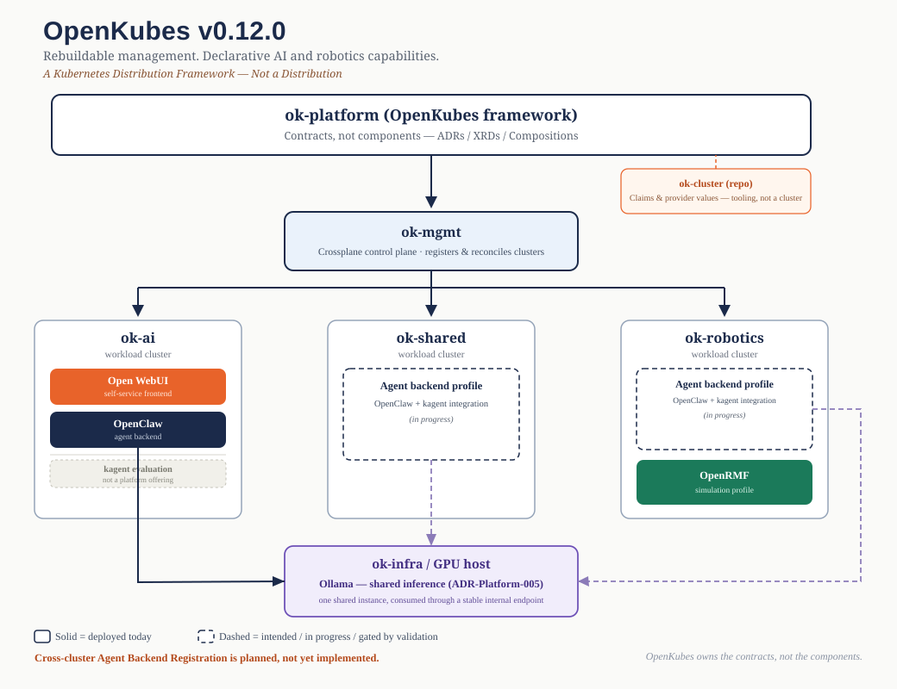

# OK-Cluster

**The OpenKubes Cluster Lifecycle Engine**

OK-Cluster is the cluster lifecycle engine for [OpenKubes](https://github.com/openkubes/openkubes) — declarative creation, operation and upgrade of Kubernetes clusters across KubeVirt, bare metal, edge and cloud.

Powered by [Cluster API (CAPI)](https://cluster-api.sigs.k8s.io/), [CAPK (KubeVirt)](https://github.com/kubernetes-sigs/cluster-api-provider-kubevirt), [Talos Linux](https://www.talos.dev/), constrained [Flatcar](https://www.flatcar.org/), and [Ubuntu/kubeadm](https://kubernetes.io/docs/setup/production-environment/tools/kubeadm/).

---

## Platform Architecture (v0.12.0)



> A Kubernetes Distribution Framework — Not a Distribution. See [ADR-Platform-013](https://github.com/openkubes/openkubes/blob/main/architecture/decisions/ADR-Platform-013-workload-cluster-registration.md) (cluster registration) and [ADR-Platform-015](https://github.com/openkubes/openkubes/blob/main/architecture/decisions/ADR-Platform-015-agentic-ai.md) (agentic AI, multi-cluster addendum) for the underlying contracts.

---

## ✨ Features

- **HA Kubernetes in ~3 minutes** — 3 control planes + N workers, fully declarative
- **Three OS paths** — Talos, constrained Flatcar/amd64/KubeVirt, and Ubuntu
- **OS layer owned by [ok-linux](https://github.com/openkubes/ok-linux)** — Talos version and schematic ID are read from ok-linux profiles, not hardcoded here
- **Auto IP/CIDR allocation** — MetalLB IPs and pod/service CIDRs allocated automatically
- **Management plane registration** — `make register-cluster` wires any workload cluster into ok-mgmt/Crossplane per [ADR-Platform-013](https://github.com/openkubes/openkubes/blob/main/architecture/decisions/ADR-Platform-013-workload-cluster-registration.md)
- **Blue/Green upgrades** — rolling Kubernetes version upgrades with workload migration
- **GitOps-ready** — all cluster state is declarative YAML, rendered from templates
- **Single Makefile UX** — `make new`, `make install`, `make status`, `make upgrade`
- **Bounded Contract Executor MVP** — a shared Go core for local CLI and future
  short-lived `ok-mgmt` Jobs; it remains dry-run-only while verifying the
  OK-141 revision, existing projection, authority split, signed grant binding,
  fail-closed single-use receipt semantics, and an offline-tested durable
  Kubernetes ledger plus short-lived read-only Job preflight boundary; its
  container build is digest-pinned, multi-architecture, non-root, SBOM- and
  provenance-producing, with a separate manual, protected and digest-verifying
  GHCR publication boundary

---

## Prerequisites

- A Kubernetes host cluster with:
  - [KubeVirt](https://kubevirt.io/) — VM runtime
  - [CDI](https://github.com/kubevirt/containerized-data-importer) — disk image importer
  - [MetalLB](https://metallb.universe.tf/) — LoadBalancer IP pool
  - [local-path-provisioner](https://github.com/rancher/local-path-provisioner) — PVC storage
  - [CAPI](https://cluster-api.sigs.k8s.io/) + [CAPK](https://github.com/kubernetes-sigs/cluster-api-provider-kubevirt) — cluster lifecycle
  - Talos Bootstrap Provider (`cacppt`) — for Talos clusters
- Tools: `clusterctl`, `helm`, `talosctl`, `kubectl`, `python3`, `make`
- Kubeconfig at `~/.kube/<host-cluster>.yaml`
- **For Talos and Flatcar clusters:** a sibling checkout of [ok-linux](https://github.com/openkubes/ok-linux) (see [OS Layer Integration](#os-layer-integration) below)
- **For Talos and constrained Flatcar:** Python 3 with HTTPS access to
  `helm.cilium.io`, or a pre-downloaded Cilium 1.19.6 chart for offline
  acquisition. Flatcar additionally requires an explicit management
  kubeconfig.

> See [OpenKubes Infrastructure](https://github.com/openkubes/openkubes/tree/main/platform/infrastructure) for host cluster setup.

---

## Quick Start

### Talos Cluster (recommended)

```bash
# Acquire once, before measuring provisioning time. A valid cache is reused.
make prepare-cilium-chart

# Scaffold a new HA Talos cluster
# Talos version and schematic ID are read from ../ok-linux automatically
make new CLUSTER=my-cluster TYPE=talos WORKERS=2

# Deploy (applies CAPI manifests, annotates PVCs, bootstraps Talos)
make bootstrap CLUSTER=my-cluster

# Get kubeconfig once nodes are Running
make kubeconfig CLUSTER=my-cluster

# Check status
make status CLUSTER=my-cluster

# Install workload-cluster storage, then observability (observability is GATED:
# the command fails unless the Contract Test Gate passes — see below)
make install-storage       CLUSTER=my-cluster
make install-observability CLUSTER=my-cluster

# Optional: register with the ok-mgmt management plane (Crossplane)
make register-cluster CLUSTER=my-cluster
```

#### Reviewed Talos KubeVirt scheduling profiles

Ordinary Talos clusters default to the existing production profile
`ok-infra`. To place both control-plane and worker VMs on `ok-gpu`, select the
reviewed provider profile explicitly:

```bash
make new \
  CLUSTER=ok-iot \
  TYPE=talos \
  SCHEDULING_PROFILE=ok-gpu \
  CP_CORES=2 \
  CP_MEMORY=4Gi \
  CP_DISK=20Gi \
  WORKER_CORES=4 \
  WORKER_MEMORY=8Gi \
  WORKER_DISK=30Gi

make talos-golden-preflight \
  CLUSTER=ok-iot \
  TALOS_INFRA_KUBECONFIG="$HOME/.kube/ok-infra.yaml"

make bootstrap \
  CLUSTER=ok-iot \
  TALOS_INFRA_KUBECONFIG="$HOME/.kube/ok-infra.yaml" \
  CILIUM_CHART="$(pwd)/.tools/cilium-1.19.6.tgz"
```

Both `ok-infra` and `ok-gpu` use the stable, replicated
`ok-storage-block` contract and the same immutable Talos Golden Image. CPU,
memory and disk sizes remain independently configurable for control-plane and
worker VMs. The read-only preflight checks the selected node's remaining
compute capacity, two-replica Longhorn capacity, KubeVirt disk expansion and
the CDI snapshot-clone path before bootstrap.

Free-form Talos KubeVirt placement fails closed. For example,
`NODE_SELECTOR=ok-gpu` without `SCHEDULING_PROFILE=ok-gpu`, a mismatched node,
an arbitrary StorageClass or an unknown profile is rejected before rendering.
The historical `gpu-single-replica` meetup profile and
`ok-storage-block-gpu-test` remain demonstration-only and are not production
fallbacks.

For local development and disposable demonstrations, the explicit
`ok-gpu-single-replica` profile selects that isolated StorageClass without
weakening either production profile:

```bash
make new \
  CLUSTER=ok-iot \
  TYPE=talos \
  SCHEDULING_PROFILE=ok-gpu-single-replica \
  WORKERS=3 \
  CP_CORES=2 CP_MEMORY=4Gi CP_DISK=20Gi \
  WORKER_CORES=2 WORKER_MEMORY=4Gi WORKER_DISK=30Gi
```

This profile places every VM and its single boot-volume replica on `ok-gpu`.
It provides no node or disk failure tolerance and must not be presented as the
stable `ok-storage-block` contract.

### Ubuntu Cluster

```bash
# Scaffold a new HA Ubuntu cluster
make new CLUSTER=my-cluster TYPE=ubuntu HA=true WORKERS=2

# Deploy (applies manifests, waits for control plane, installs Cilium)
make install CLUSTER=my-cluster

# Get kubeconfig
make kubeconfig CLUSTER=my-cluster
```

### Constrained Flatcar Cluster

Flatcar is supported only inside the exact ADR-009 envelope: stable 4593.2.4,
amd64, KubeVirt, Kubernetes v1.34.1, one control-plane and one worker. There is
no fallback and unsupported overrides fail before rendering.

```bash
# Online acquisition from the authoritative Helm repository:
make prepare-cilium-chart

# Or offline/pre-downloaded acquisition:
make prepare-cilium-chart \
  CILIUM_CHART_SOURCE=/media/artifacts/cilium-1.19.6.tgz

# Both commands atomically publish the verified chart here:
#   $(pwd)/.tools/cilium-1.19.6.tgz

make new CLUSTER=my-flatcar TYPE=flatcar

make flatcar-preflight \
  CLUSTER=my-flatcar \
  FLATCAR_INFRA_KUBECONFIG=/path/to/ok-infra.yaml \
  FLATCAR_CILIUM_CHART="$(pwd)/.tools/cilium-1.19.6.tgz"

make install-flatcar \
  CLUSTER=my-flatcar \
  FLATCAR_INFRA_KUBECONFIG=/path/to/ok-infra.yaml \
  FLATCAR_CILIUM_CHART="$(pwd)/.tools/cilium-1.19.6.tgz" \
  FLATCAR_APPLY=yes
```

`prepare-cilium-chart` downloads only
`https://helm.cilium.io/cilium-1.19.6.tgz` and requires SHA-256
`21c43cf53841f9ab0375047d95aa4c64051ea52bbd2c679416e6408f5f1c9179`.
The `.tools/` cache is git-ignored. A valid cached file is reused without
network access; an invalid cache or pre-downloaded file fails closed and is
never silently replaced. Move an invalid cached file aside before deliberately
acquiring it again. `make verify-cilium-chart` performs verification only and
never downloads.

The guarded installer requires clean, pushed `ok-linux` and `ok-cluster`
commits, verifies the exact CAPI/CABPK/KCP 1.13.3, CAPK 0.11.2, KubeVirt 1.8.1
management envelope plus the Ignition gates and golden-image identity, and uses
the digest-bound local Cilium 1.19.6 chart without a public artifact fetch.
Generic `install`, `bootstrap`, `install-cni`, `upgrade`, `clean`, and
`teardown` targets refuse Flatcar.

#### Verified runtime: `ok-flatcar` (2026-07-30)

The historical
[`ok-flatcar/cluster-config.yaml`](https://github.com/openkubes/ok-cluster/blob/dcbc706f4b027743d765cedd8848d5e1837b2a1f/ok-flatcar/cluster-config.yaml)
was the first ordinary deployment of the production-constrained profile. It
was reviewed in [PR #18](https://github.com/openkubes/ok-cluster/pull/18) and
merged as `dcbc706`. The guarded install completed in an observed 3m13s; this
duration is evidence from that run, not an availability or provisioning-time
SLO. The disposable cluster was subsequently torn down and its active
declaration removed after verification.

| Signal | Verified result |
|---|---|
| CAPI Cluster | `Provisioned`, `Available=True` |
| Topology | one control-plane and one worker |
| Nodes | 2/2 `Ready` |
| OS | Flatcar Container Linux 4593.2.4 (Oklo), amd64 |
| Kubernetes | kubelet v1.34.1 |
| Provider identity | both ProviderIDs start with `kubevirt://` |
| Cilium | DaemonSet 2/2 available, operator 1/1 available |
| Lifecycle | Secret-backed Ignition; replacement-only; no SSH authority |

The post-install checks were recorded with explicit kubeconfig paths:

```bash
kubectl --kubeconfig ~/.kube/ok-flatcar.yaml get nodes
kubectl --kubeconfig ~/.kube/ok-flatcar.yaml get pods -A
kubectl --kubeconfig ~/.kube/ok-infra.yaml \
  -n ok-flatcar get cluster ok-flatcar
```

Keep workload and management kubeconfigs under `~/.kube/`. Do not copy them
into the repository, and prefer explicit `--kubeconfig` arguments over a
long-lived `KUBECONFIG` export when recording operational evidence.

---

## Management Plane Registration (ADR-Platform-013)

To let Crossplane on the management cluster (ok-mgmt) deploy into a workload cluster, the cluster must be **registered**: a kubeconfig secret `<cluster>-kubeconfig` in `crossplane-system` plus a same-named provider-helm `ProviderConfig`. The cluster name is the single join key — Compositions target the cluster via `providerConfigRef.name: <cluster>`.

```bash
# Standard case: kubeconfig at ~/.kube/<cluster>.yaml (written by make bootstrap)
make register-cluster CLUSTER=ok-ai

# Externally provided kubeconfig (e.g. handed over by another cluster owner)
make register-cluster CLUSTER=ok2-rmf KUBECONFIG_SRC=~/incoming/ok2-rmf.yaml
```

The target validates the source kubeconfig first (fail fast) and uses **replace semantics** — the same command handles first registration and re-registration. **Re-run it after every re-bootstrap of the cluster** (cluster owner's responsibility); this retires the stale-secret trap.

Registration is deliberately **not** part of `make bootstrap`: bootstrap acts on the workload cluster, registration writes to the management plane — two different trust boundaries.

Deregistration is the explicit counterpart (OK-62). After `make teardown`, the kubeconfig secret and ProviderConfig remain orphaned in ok-mgmt by design — remove them with:

```bash
make unregister-cluster CLUSTER=ok1-talos
```

The target refuses if Releases still reference `providerConfigRef.name: <cluster>` (deleting the ProviderConfig under active Releases leaves Crossplane unable to reconcile or uninstall them) — delete the claims first, or override with `FORCE=true` (Crossplane usage protection then keeps the ProviderConfig in Terminating until all Releases are gone). Idempotent; deliberately **not** part of `make teardown` — same trust-boundary argument as registration.

> Contract: [ADR-Platform-013 — Workload cluster registration contract](https://github.com/openkubes/openkubes/blob/main/architecture/decisions/ADR-Platform-013-workload-cluster-registration.md). The Make target is its non-normative reference implementation.

---

## OS Layer Integration

ok-cluster does not own OS identity or verified image inputs.
**[ok-linux](https://github.com/openkubes/ok-linux) is the source of truth.**

```
ok-linux/profiles/kubevirt/profile.yaml
        ↓  (talos.version, talos.schematic_id — verified via make build/verify in ok-linux)
ok-cluster/render.py  reads this file from a sibling checkout
        ↓
cluster-config.yaml   os.profile: kubevirt, os.schematic_id: <resolved>
        ↓
cluster-v2.yaml        openkubes.io/talos-schematic annotation
        ↓
Running cluster
```

For Flatcar, the isolated resolver consumes
`ok-linux/profiles/flatcar-kubevirt/profile.yaml` and rejects any value outside
ADR-009. KubeVirt transport, target storage, scheduling, and CAPI lifecycle
remain owned by ok-cluster.

**Expected directory layout:**

```
~/your-workspace/
├── ok-linux/      ← github.com/openkubes/ok-linux
└── ok-cluster/    ← this repo
```

If `ok-linux` is checked out elsewhere, set `OK_LINUX_PATH`:

```bash
export OK_LINUX_PATH=/path/to/ok-linux
make render CLUSTER=my-cluster
```

The legacy Talos path retains its existing defaults. Flatcar has no fallback:
if the exact ok-linux production profile cannot be loaded and validated,
rendering stops.

To change which OS profile a cluster uses, set `OS_PROFILE` when scaffolding:

```bash
OS_PROFILE=baremetal make new CLUSTER=my-cluster TYPE=talos
```

---

## All Makefile Targets

```
make new           CLUSTER=<name> TYPE=ubuntu|talos|talos-mgmt|flatcar
make render        CLUSTER=<name>                    # re-render manifests from config
make prepare-cilium-chart                            # acquire/reuse pinned Cilium chart
make verify-cilium-chart                             # offline digest verification
make install       CLUSTER=<name>                    # ubuntu: apply + wait + cilium
make bootstrap     CLUSTER=<name>                    # talos: apply + annotate PVCs + cilium
make flatcar-preflight CLUSTER=<name> FLATCAR_INFRA_KUBECONFIG=<path> FLATCAR_CILIUM_CHART="$(pwd)/.tools/cilium-1.19.6.tgz"
make install-flatcar CLUSTER=<name> FLATCAR_INFRA_KUBECONFIG=<path> FLATCAR_CILIUM_CHART="$(pwd)/.tools/cilium-1.19.6.tgz" FLATCAR_APPLY=yes
make teardown-flatcar CLUSTER=<name> FLATCAR_INFRA_KUBECONFIG=<path> FLATCAR_TEARDOWN=yes
make kubeconfig    CLUSTER=<name>                    # save kubeconfig to ~/.kube/<name>.yaml
make install-cni   CLUSTER=<name>                    # install Cilium (manual)
make install-storage CLUSTER=<name>                  # install local-path-provisioner *inside* the workload cluster
make install-ingress CLUSTER=<name>                  # Traefik + IngressClass ok-ingress + host-cluster LB proxy
make install-observability CLUSTER=<name> [OBSERVABILITY_VALUES=<path>]  # OK-79: deploy ok-observability-standard + run the GATED contract test
make install-observability-metrics CLUSTER=<name>    # OK-138: Prometheus + Alertmanager only; verify zot scraping
make register-cluster CLUSTER=<name> [KUBECONFIG_SRC=<path>] [MGMT_CLUSTER=ok-mgmt]  # register with ok-mgmt (ADR-013)
make unregister-cluster CLUSTER=<name> [FORCE=true] [MGMT_CLUSTER=ok-mgmt]           # deregister from ok-mgmt (OK-62)
make annotate-pvcs CLUSTER=<name>                    # annotate PVCs for node binding
make upgrade       CLUSTER=<name> K8S_VERSION=v1.x.y [TALOS_VERSION=v1.x.y]
make status        CLUSTER=<name>                    # show cluster, machines, VMs
make clean         CLUSTER=<name>                    # delete ubuntu cluster + local files
make teardown      CLUSTER=<name>                    # delete talos cluster + local files
make teardown-all                                    # tear down ALL rendered clusters
make e2e           [OLLAMA_URL=http://<ip>:11434]    # full clean rebuild + verify
make e2e-verify                                      # verification matrix only
make list                                            # list all defined clusters
```

> **`install-storage` is not the same layer as [ok-storage](https://github.com/openkubes/ok-storage).**
> This target installs `local-path-provisioner` *inside* the newly created
> workload (Talos) cluster, for that cluster's own pods — node-local,
> non-replicated, no cross-node redundancy. `ok-storage` (Longhorn v1)
> runs on the RKE2 *host* cluster instead, one layer down, and is what
> backs `KubeVirtClusterClaim`/VM disks and anything needing real
> replication or RWX. Don't confuse workload-cluster `local-path` with the
> host cluster's `ok-storage-local` contract class — same underlying
> provisioner, different cluster, different guarantees.

> **`install-observability` is a GATED target (OK-79, ADR-Platform-018).**
> ok-cluster *installs* the capability; it does not *own* it — all assets
> (the `ok-observability-standard` profile, alerting rules, dashboards, and the
> contract test) come from the [ok-observability](https://github.com/openkubes/ok-observability)
> repo checkout at `$(OK_OBSERVABILITY_PATH)` (default `../ok-observability`).
> The target: labels the namespace for privileged Pod Security, creates the
> Kubernetes Secret `ok-observability-credentials` from a git-ignored
> provider-values file (`OBSERVABILITY_VALUES`, default
> `../ok-observability/<cluster>.provider-values.yaml`, schema:
> `grafanaAdminPassword` / `opensearchAdminPassword`), `helm install`s the
> profile, applies rules + dashboards, and finally runs
> `ok-observability/tests/contract-test.sh`. **The command exits non-zero unless
> all five contract guarantees pass** (metric ingestion, Grafana datasource,
> OpenSearch log search, alert firing, declarative registration) — i.e. a
> cluster is "observability-ready" only when the gate is green. The charts read
> the admin passwords from the Secret (Grafana `admin.existingSecret`, OpenSearch
> `secretKeyRef`, Fluent Bit `${OPENSEARCH_PASSWORD}`); no plaintext password is
> passed to helm. This file-based step is the offline-reconcilable profile;
> datacenter-envelope clusters have the same Secret populated from Vault on
> ok-shared by a `VaultStaticSecret` via the Vault Secrets Operator
> (ADR-Platform-025) instead, with no chart change. The two profiles coexist by
> envelope rather than in sequence (Secret Contract, ADR-Platform-011).

> **`install-observability-metrics` is the deliberately scoped OK-138 path.**
> Its capability assets come from the materialized
> `implementations/prometheus` chart and `alerting/prometheus-rules.yaml`; an
> optional `OBSERVABILITY_HELM_VALUES` file
> can supply cluster-specific storage, retention, and resource Provider Values.
> It installs into namespace `ok-observability` using Helm release
> `ok-observability-standard`, so a later full-profile install upgrades the same
> release instead of colliding over resource ownership. This path does not
> require provider credential values or Vault, does not create the observability
> credential Secret or Vault resources, does not apply Grafana dashboards or
> OpenSearch assets, and does not run the full contract test. Before install, a
> YAML-aware render guard requires a Prometheus resource, requires the bundled
> Grafana subchart to be explicitly disabled, and rejects any Grafana/OpenSearch
> Deployment or StatefulSet as well as any creation or reference of
> `ok-observability-credentials`. After install, the scoped gate connects to
> waits for both the Prometheus and Alertmanager resources to become Available,
> then connects to Prometheus and requires both an active `health=up` target whose discovered
> Kubernetes namespace and Service are `zot`, and a real sample returned by
> `{__name__=~"zot_.+"}`; it prints the selected target discriminator and metric
> value.

---

## Cluster Types

### Talos (immutable, API-driven)

Uses [Talos Linux](https://www.talos.dev/) via the OpenStack-compatible qcow2 image from [Talos Image Factory](https://factory.talos.dev/). No SSH, no package manager — fully declarative and immutable. Talos version and schematic ID come from [ok-linux](https://github.com/openkubes/ok-linux) — see [OS Layer Integration](#os-layer-integration).

For KubeVirt workload clusters, OK-130 separates image publication from
cluster provisioning. The exact digest-pinned qcow2 is published once by
`ok-linux` to an immutable PVC in `ok-images`; control-plane and worker disks
are local CDI clones on `ok-storage-block`. `make bootstrap` runs a read-only
KubeVirt `ExpandDisks`, Golden-PVC and clone-RBAC preflight before applying the
existing Talos CAPI objects. `ExpandDisks` is required because filesystem
snapshot clones retain the Golden `disk.img` virtual size; KubeVirt expands it
to the requested boot-PVC capacity before Talos starts. Talos machine
configuration and credentials remain dynamically generated by the Talos CAPI
providers.

```bash
make new CLUSTER=ok-ai TYPE=talos WORKERS=2
make bootstrap CLUSTER=ok-ai
```

### Opt-in trust for the shared internal registry

Talos clusters that pull from `registry.ok-shared.internal` opt in explicitly:

```bash
make new CLUSTER=my-cluster TYPE=talos REGISTRY_TRUST=true
make bootstrap CLUSTER=my-cluster
```

The CA and ingress address are resolved only at execution time; neither is
stored in rendered files. Existing clusters use the review/dry-run/apply
targets documented in [Talos registry trust](docs/registry-trust.md).

For a complete disposable `ok-infra` meetup deployment with independent
control-plane/worker sizing, timed warm provisioning, runtime verification,
and Golden-Image-preserving cleanup, see the
[Talos on `ok-infra` meetup demo runbook](docs/ok-talos-infra-node-meetup-demo-runbook.md).

### Ubuntu (kubeadm, flexible)

Uses [CAPK container disk images](https://quay.io/repository/capk/ubuntu-2404-container-disk) — nodes are ready in ~2 minutes.

```bash
make new CLUSTER=ok1 TYPE=ubuntu HA=true WORKERS=2
make install CLUSTER=ok1
```

### Flatcar (constrained, immutable)

Consumes only the promoted `ok-linux` `flatcar-kubevirt` profile. The ordinary
resolver is fail-closed to the exact amd64/KubeVirt envelope and uses
replacement-only Day-2 convergence without SSH or guest mutation.
Its immutable Golden PVC remains in `ok-images`; profile revision 5 creates
control-plane and worker CDI snapshot clones on Longhorn
`ok-storage-block` with 50 GiB boot capacity. The preflight requires the exact
StorageClass/CDI StorageProfile, `ok-storage-block-snapshot`, and KubeVirt
`ExpandDisks` contracts. The supported teardown removes retained clone PVs,
Longhorn volumes, temporary CDI snapshots, and clone RBAC while preserving the
shared Golden PVC.
See [Constrained Flatcar Cluster](#constrained-flatcar-cluster) for the
canonical scaffold, preflight, install, and verified-runtime procedure.

### Flatcar/Talos provisioning benchmark

The guarded OK-128 observer measures the exact supported `install-flatcar`
and `bootstrap` targets without owning either lifecycle. It verifies the
pinned local Cilium chart before timing, records a nine-point Kubernetes
timeline plus sanitized raw evidence, rejects non-comparable or overlapping
runs, and keeps cold Golden-Image publication outside warm provisioning time.
See the
[controlled benchmark runbook](docs/adoption/OK-128/benchmark-runbook.md);
live targets require explicit Runtime GO and `OK128_BENCHMARK_APPLY=yes`.

---

## Templating System

```
cluster-config.yaml  →  render.py  →  CAPI manifests  →  make install/bootstrap
```

`render.py` reads `cluster-config.yaml`, resolves `auto` values for IPs and
CIDRs, dispatches selected OS-profile resolution, and renders the CAPI manifest
templates. Flatcar resolution is isolated and fail-closed; it does not add
Flatcar defaults to shared or Talos semantics. All resolved values are written
back to `cluster-config.yaml` for reproducibility.

### cluster-config.yaml

```yaml
name: my-cluster
  type: talos          # or ubuntu / talos-mgmt / constrained flatcar

controlPlane:
  replicas: 3        # 1 = single, 3 = HA
  cores: 2
  memory: 4Gi

workers:
  replicas: 2
  cores: 2
  memory: 4Gi
  disk: 15Gi

# OS layer — resolved from ok-linux, talos only.
# Set explicitly here, or let render.py resolve it from ../ok-linux.
os:
  distribution: ok-linux
  profile: kubevirt
  schematic_id: ce4c980550dd2ab1b17bbf2b08801c7eb59418eafe8f279833297925d67c7515

versions:
  kubernetes: v1.36.2
  talos: v1.9.5      # talos only — resolved from ok-linux if omitted

network:
  endpoint: auto     # auto-allocates next free LoadBalancer IP
  podCIDR: auto      # auto-allocates next free /16
  serviceCIDR: auto  # auto-allocates next free /20

nodeSelector: ""     # pin VMs to a specific host node (required for Talos PVC binding)

# Optional: required when CAPK runs on a separate management cluster and the
# KubeVirt runtime is external. The referenced Secret must already exist on
# the management cluster; ok-cluster never renders credential contents.
infraClusterSecretRef:
  name: external-infra-kubeconfig-my-cluster
  namespace: my-cluster

upgrade:
  strategy: blue-green
  workloadMigration:
    stateless: gitops
    stateful: app-native
```

If `infraClusterSecretRef` is absent, CAPK intentionally uses its management
cluster as the KubeVirt infrastructure cluster. For a split `ok-mgmt` / external
`ok-infra` topology, bind the per-cluster Secret explicitly; otherwise CAPK can
create the control-plane LoadBalancer Service in the wrong authority domain.

### Auto-Allocation Pools

| Resource     | Pool                  | Size per Cluster |
|--------------|-----------------------|-----------------|
| MetalLB IP   | Configurable          | 1 IP            |
| Pod CIDR     | `10.32.0.0/11`        | /16             |
| Service CIDR | `10.96.0.0/12`        | /20             |

> Pool ranges are configured in `render.py` — adapt to your MetalLB setup.

---

## Repository Structure

```
ok-cluster/
├── Makefile                  # all lifecycle targets
├── render.py                 # template engine, auto IP/CIDR allocation, ok-linux integration
├── profile_resolvers/
│   └── flatcar.py            # exact ADR-009 consumer boundary
├── scripts/
│   └── flatcar_lifecycle.py  # guarded preflight/install/teardown
├── new-cluster.sh            # cluster scaffolding
├── upgrade-cluster.sh        # blue/green upgrade
├── templates/
│   ├── flatcar/
│   │   ├── cluster-v2.yaml.tpl      # Ignition + identity-bound templates
│   │   └── cilium-values.yaml.tpl   # pinned Flatcar CNI profile
│   ├── talos/
│   │   ├── cluster-base.yaml.tpl    # CAPI + CAPK + Talos manifests
│   │   ├── cluster-v2.yaml.tpl
│   │   ├── bootstrap.sh.tpl
│   │   └── generate-manifest.sh.tpl
│   └── ubuntu/
│       ├── cluster-v2.yaml.tpl      # CAPI + CAPK + kubeadm manifests
│       └── generate-manifest.sh.tpl
└── cluster-config.yaml.example      # example cluster config
```

> Rendered cluster directories (`my-cluster/`) contain only non-sensitive private IPs and may be committed deliberately. Secret material (Talos configs, kubeconfigs) is generated at runtime and never enters Git — the cluster instances themselves are reachable via VPN only.

---

## Part of OpenKubes

OK-Cluster is the cluster lifecycle layer of the OpenKubes platform. It owns *how* a cluster is created, scaled, and upgraded — never *which* OS image runs on its nodes:

```
OpenKubes
├── ok-local      — Local development (Multipass)
├── ok-cluster    — Cluster Lifecycle Engine  ← you are here
├── ok-linux      — OS profiles, Image Factory, MachineConfig (source of truth for Talos)
├── ok-storage    — Persistent Storage Contract (Longhorn v1)
├── ok-observability — Per-cluster Observability Contract (Prometheus/Grafana/OpenSearch, ADR-018)
├── ok-gitops     — GitOps bootstrap (ArgoCD)
└── ok-apps       — Platform applications
```

> ok-cluster expresses intent. ok-linux is the source of truth.
> See [ok-linux's architecture docs](https://github.com/openkubes/ok-linux/blob/main/docs/spec.md) for the full contract.

- [OpenKubes](https://github.com/openkubes/openkubes)
- [OK-Linux](https://github.com/openkubes/ok-linux)
- [OK-Storage](https://github.com/openkubes/ok-storage)
- [OK-Observability](https://github.com/openkubes/ok-observability)
- [OK-Local](https://github.com/openkubes/ok-local)

---

## License

Apache 2.0 — see [LICENSE](LICENSE)
