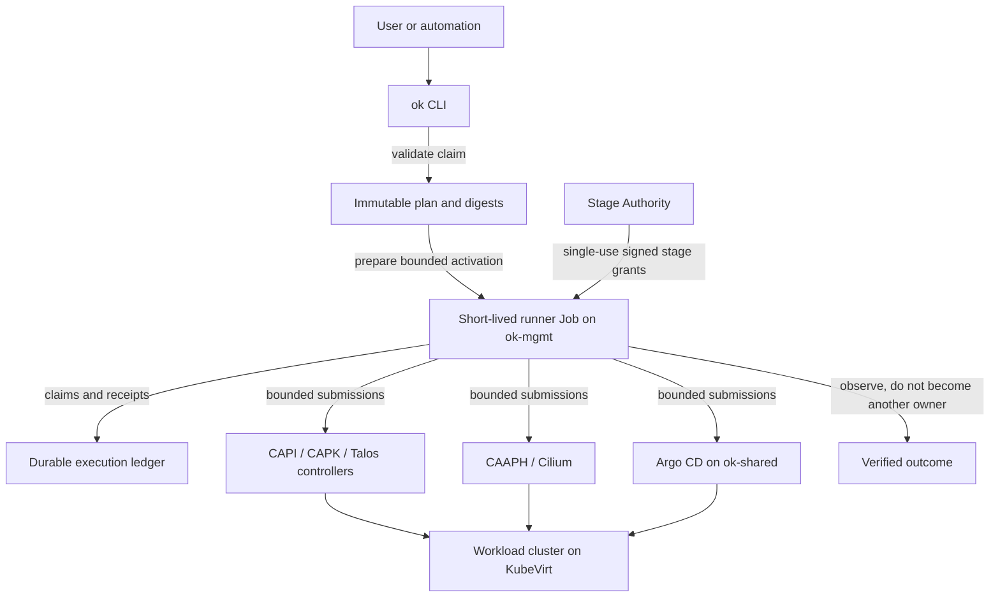
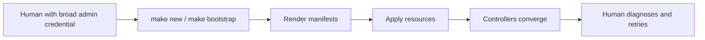

# From `make` to a bounded cluster runner

## Why creating a cluster becomes more complicated before it becomes simpler

OpenKubes can already create clusters with familiar administrative workflows
such as `make new` and `make bootstrap`. The OK-147 runner takes a deliberately
different path: it turns cluster creation into a bounded, reproducible and
auditable execution rather than a trusted administrator session.

This insight explains the current proof of concept, the intended `ok` CLI user
experience, the role of Talos Linux, and why the runner provides stronger
safety properties than the existing Make-based workflow.

> **Talk takeaway:** `make` answers “How do we execute these commands?” The
> bounded runner additionally answers “Who may execute exactly what, against
> which authority, from which reviewed input, and how can we prove the result?”

## The `ok` CLI and the runner

The `ok` CLI is the user-facing entry point. The in-cluster runner uses the
same Go implementation for the security-sensitive planning, verification and
execution logic.

The code is currently divided into a small command layer and reusable internal
packages:

- `cmd/ok` contains the CLI entry point and command wiring.
- `internal/runner` contains planning, packaging, staged execution and
  observation logic.
- `internal/stageauthority` derives and serves bounded stage grants.
- `internal/stageattempt` verifies one exact execution attempt.
- `internal/stageplan` validates the ordered execution plan.
- `internal/ledger` records claims and outcomes durably.

The responsibilities are intentionally separated:



The runner is an orchestrator and observer. It does not replace CAPI, CAAPH,
Cilium or Argo CD as a reconciler. It submits reviewed intent, observes the
responsible controllers and stops fail-closed when reality no longer matches
the bound execution.

## Current proof-of-concept workflow

The current OK-147 workflow still exposes internal safety mechanisms. It is
therefore much more verbose than the intended product interface.

```text
local preparation
    -> verify ExecutionAttempt and staged plan
    -> derive the Stage Authority policy
    -> bind a digest-pinned runner image
    -> issue short-lived, audience-bound tokens
    -> build an immutable activation package
    -> create a bounded Job on ok-mgmt
    -> execute and observe Stages 1-12
```

Representative command groups look like this:

```bash
# Verify the exact execution attempt.
ok cluster stage attempt verify ...

# Derive a policy from the verified staged plan.
ok authority stage policy ...

# Prepare the full-run activation package.
ok cluster stage run full prepare ...
ok cluster stage run full package ...
ok cluster stage run full launch prepare ...
```

The launch package contains four ephemeral Kubernetes objects on `ok-mgmt`:

```text
immutable Secret    full-run activation material
immutable Secret    independent evidence authority material
NetworkPolicy       exact network boundary for the run
Job                 digest-pinned runner execution
```

The objects are submitted Create-only. Conceptually, the final operation is:

```bash
kubectl --kubeconfig <management-kubeconfig> create \
  -f <verified-full-run-package>
```

The runner Job then executes the ordered lifecycle:

| Stage | Responsibility |
|---:|---|
| 1 | Create provider prerequisites on `ok-infra` |
| 2 | Submit the CAPI cluster lifecycle objects on `ok-mgmt` |
| 3 | Observe lifecycle convergence |
| 4 | Submit the CAAPH enablement object for Cilium |
| 5 | Observe network readiness |
| 6 | Derive and verify the runtime binding |
| 7 | Create least-privilege target access |
| 8 | Issue the short-lived target credential |
| 9 | Register the target with Argo CD on `ok-shared` |
| 10 | Create the bound Argo CD Applications |
| 11 | Observe platform readiness |
| 12 | Correlate and evaluate the evidence |

The runner does not create the virtual machines directly:

```text
runner
  -> CAPI, CAPK and Talos resources on ok-mgmt
      -> controllers
          -> KubeVirt VMs and storage on ok-infra
              -> Talos Kubernetes workload cluster
```

## Intended cluster-creation experience

Once the runner and stable CLI surface are productized, users should not have
to handle stage grants, token files, digests, activation Secrets or Jobs
manually. The expected interface is:

```bash
ok cluster create -f cluster.yaml
ok cluster status dev-team-a
ok cluster kubeconfig dev-team-a --output ~/.kube/dev-team-a.yaml
```

A future cluster claim could look like this:

```yaml
apiVersion: openkubes.io/v1alpha1
kind: ClusterClaim
metadata:
  name: dev-team-a
spec:
  profile: kubevirt-talos-dev
  kubernetesVersion: v1.36.2
  controlPlane:
    replicas: 1
  workers:
    replicas: 2
  infrastructure:
    cpu: 4
    memory: 8Gi
    storage: 50Gi
  platform:
    observability: true
    gitOps: true
```

The CLI would validate the claim, resolve the selected profile, create the
immutable plan, obtain short-lived capabilities, launch the runner and show a
human-readable status:

```text
Provider prerequisites   PASS
Cluster lifecycle        PASS
Control plane            READY
Worker nodes              2/2 READY
Network                   READY
Platform                  READY
Evidence                  VERIFIED

Cluster dev-team-a is ready.
```

The exported Kubeconfig remains local and is written with file mode `0600`.

## Operating system: Talos Linux

The currently validated KubeVirt path uses **Talos Linux** for both control
plane and worker virtual machines.

- CAPI owns the declarative cluster lifecycle.
- CAPK creates the KubeVirt infrastructure.
- The Talos control-plane and bootstrap providers configure Kubernetes.
- A reviewed Talos golden image is supplied through the provider boundary.
- Administration is API-driven with Talos configuration and `talosctl`, not
  traditional SSH-based host management.

Other operating systems can be added later through separately tested profiles.
They are not part of the currently proven path.

## Does every Kubernetes release require runner changes?

No. Patch releases should normally require compatibility tests rather than
code changes. The runner relies mainly on stable Kubernetes APIs and explicit
API operations.

Changes may nevertheless be required when:

- Kubernetes removes or promotes an API version;
- CAPI, CAPK, CAAPH, KubeVirt, Cilium or Argo CD change resource or Condition
  semantics;
- API defaulting or serialization introduces another valid representation;
- TokenRequest, admission or Server-Side Apply behavior changes;
- client and server versions leave their supported version-skew range.

The desired engineering model is therefore:

```text
patch release  -> automated compatibility tests
minor release  -> compatibility run and evidence review
API change     -> small adapter/normalization change plus regression tests
unknown shape  -> fail closed
```

The runner should normalize semantically equivalent responses while continuing
to reject ambiguous or unrecognized state.

## Persistent DEV support resources

The disposable workload cluster is temporary, but the current DEV environment
contains a small execution “workshop” used to launch bounded runs.

On `ok-mgmt` this includes the execution namespace, Stage Authority,
ServiceAccounts, least-privilege RBAC, admission policies and ledger
infrastructure. On `ok-infra` it includes narrowly scoped provider-writer and
golden-image prerequisites. On `ok-shared` it includes the GitOps-writer and
its Argo CD boundary.

Private keys, Kubeconfigs, raw evidence and short-lived tokens are local-only
material. They must not enter Git history. Old run-specific Secrets and other
obsolete test resources should be removed after the final closure, while the
components selected for the future runner service can remain as managed
platform infrastructure.

## Why `make new` and `make bootstrap` feel simpler

The Make-based workflow is a trusted administrator workflow:



It is short because it assumes:

- the local operator and machine are trusted;
- a broad administrator credential may be used;
- the rendered content is correct at execution time;
- a human will interpret partial state and choose the next command;
- retries and cleanup can be handled procedurally.

That is useful for development and bootstrap, but it does not automatically
provide a durable answer to who authorized each mutation, which exact input
was executed, whether a grant was reused, or how a crash should be resumed.

## What the bounded runner adds

The runner pays an up-front complexity cost to provide properties required for
safe unattended automation:

| Concern | Make-based admin workflow | Bounded runner |
|---|---|---|
| Identity | Human/admin credential | Stage-specific workload identity |
| Credential lifetime | Often long-lived | Short-lived TokenRequest |
| Authorization | Implicit in admin access | Explicit, signed, single-use grant |
| Input integrity | Working tree and command | Canonical content and SHA-256 bindings |
| Multi-cluster authority | Operator switches contexts | Separate `ok-mgmt`, `ok-infra`, `ok-shared` capabilities |
| Partial state | Human interpretation | Durable claims, receipts and fail-closed stop |
| Retry | Procedural | New, explicitly bound execution attempt |
| Convergence | Human watches controllers | Bounded observation with semantic checks |
| Ownership | Easy to blur | Runner observes; native controllers reconcile |
| Auditability | Shell and CI logs | Correlated stage ledger and redacted evidence |

In short:

```text
make new / make bootstrap
    “Run these administrator procedures.”

bounded runner
    “Prove who may execute this exact reviewed operation once,
     observe the responsible controller, record the outcome,
     and stop safely on every unbound condition.”
```

## The paradox: more machinery, simpler usage

The current proof of concept exposes the machinery because OK-147 is testing
that machinery. The final user should see fewer steps than today, not more:

```bash
ok cluster create -f cluster.yaml
```

Behind that command, the CLI retains the digest chain, least-privilege tokens,
Stage Authority, durable ledger, bounded observations and redacted evidence.
The complexity moves from the operator’s runbook into tested software.

That is the central architectural benefit: **Make offers a convenient trusted
procedure; the runner turns that procedure into a safe, repeatable platform
capability.**

## Expected productization effort

Much of the security-sensitive core already exists. A first internal CLI MVP
covering `create`, `status` and local `kubeconfig` retrieval is estimated at
roughly one to two focused engineering weeks. A robust first release including
delete, recovery, compatibility coverage, packaging and polished diagnostics
is more realistically three to four weeks.

A public `ClusterClaim` CRD plus a continuously running controller would be a
separate productization step and may require an additional two to four weeks.
Those estimates assume the bounded runner completes its end-to-end validation
without uncovering another independent failure domain.

## Suggested CNCF Aachen narrative

1. Begin with the familiar `make new && make bootstrap` experience.
2. Ask what happens when the human operator is removed.
3. Show the missing guarantees: identity, one-time authorization, crash state,
   multi-cluster authority and evidence.
4. Introduce the bounded runner as orchestration without taking ownership away
   from Kubernetes controllers.
5. End with the target UX: one declarative claim and one `ok cluster create`
   command, backed by verifiable execution.

The message is not that Make is wrong. Make remains valuable for development
and trusted bootstrap. The message is that unattended platform automation
requires a stronger execution contract than a shell procedure alone can
provide.
